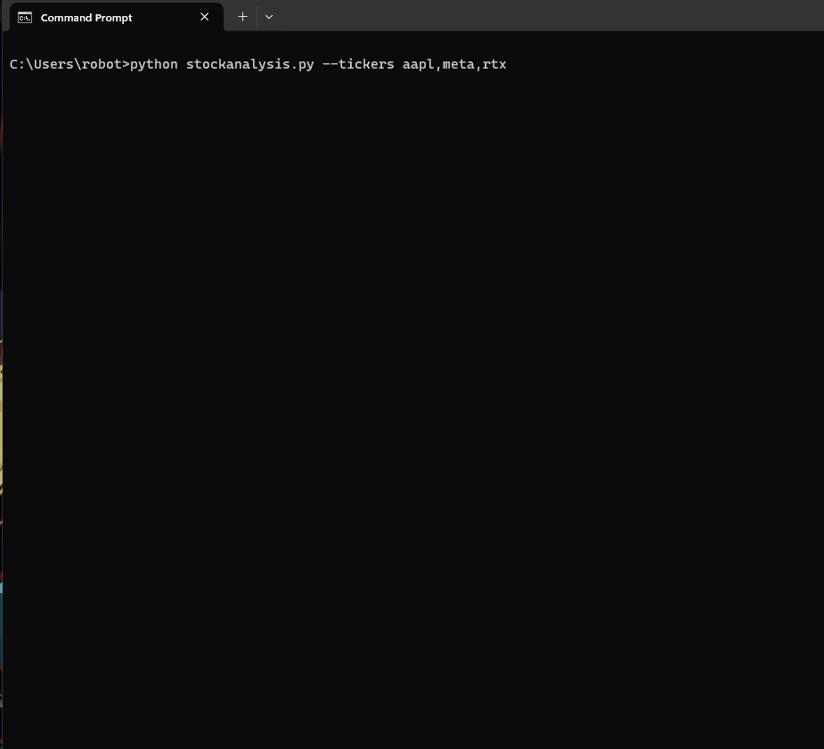

# 📈 Stock Analysis Tool

This Python-based tool is designed to analyze stock performance by employing various strategies, with a focus on maximizing profits through optimal buy and sell times. It utilizes historical data from Yahoo Finance and allows users to test different scenarios with an array of customization options.
- Specifically it uses the 5 minute intraday trading data and bruteforces the best buy/sell times for a single buy/sell per day based on the weekday. 


<p align="center">
  
</p>

## Features

- **Customizable Analysis**: Pick specific days, a set number of random stocks, or provide a list of ticker symbols.
- **Live Data Option**: Fetch the latest day's data for real-time insights.
- **Comprehensive Metrics**: Includes calculations for speculative future balances with and without compounding.
- **User-friendly CLI**: Easy-to-navigate command-line interface for seamless interaction.

## 🚀 Getting Started

### Prerequisites

Ensure you have the following installed:
- Python 3.x
- pandas
- yfinance

### Installation

1. Clone the repository:
   ```bash
   git clone https://github.com/pentestfunctions/intradaytrading.git
   ```
2. Navigate into the project directory:
   ```bash
   cd intradaytrading
   ```
3. Install required Python packages:
   ```bash
   pip install -r requirements.txt
   ```

### Usage

Run the script with custom arguments as needed:

1. This will run with 15 random stocks for the day Friday and a starting balance of 20000
```bash
python stockanalysis.py --day Friday --random 15 --balance 20000
```

Or use the default settings:
2. This will run for Tuesday, with 10 random stocks, starting balance $15000, Transaction fee of $0.01 per trade
```bash
python stockanalysis.py
```

3. Running with custom tickers
```bash
python stockanalysis.py --tickers aapl,meta,rtx
```

4. Running with all possible flags (and hardcoded tickers)
```
python stockanalysis --random 37 --day thursday --balance 10000 --fee 0.01 
```

### Options

- `--day`: Day of the week to analyze (default: Tuesday).
- `--random`: Number of random stocks to pick (default: 10).
- `--balance`: Starting balance for analysis (default: $15,000).
- `--fee`: Trading fee per transaction (default: $0.01).
- `--tickers`: Comma-separated list of ticker symbols (e.g., `aapl,meta,msft`).
- `--live`: Use the last day's data for tickers.

## 📊 Examples

- Analyzing specific stocks on Monday:
  ```bash
  python stockanalysis.py --tickers aapl,meta --day monday
  ```

- Using live data for analysis (Not currently working, however deleting the ticker_data folder to get the latest 60 days:
  ```bash
  python stockanalysis.py --live
  ```

## 🛠️ Development

Feel free to fork the repository and submit pull requests. For major changes, please open an issue first to discuss what you would like to change.

## 📝 License

Distributed under the WTFPL License.

## 📬 Contact

Project Link: [https://github.com/pentestfunctions/intradaytrading](https://github.com/pentestfunctions/intradaytrading)

---

💡 **Pro Tip:** For better readability and maintainability, consider breaking down the README into multiple files if the project grows significantly. For instance, separate files for installation instructions, usage examples, and contribution guidelines can enhance user experience.
